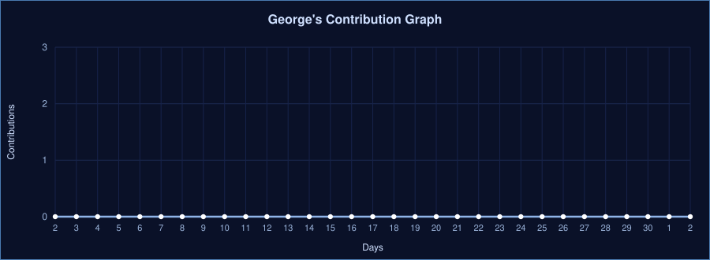

  

 

  
  
  

<h2 align="center"> <i>Technologies</i></h2>

  
  
  
  
  
  
   
  
  
  
  
  
  
   
  
  
  
  
  

<h2 align="center"> <i>Statistics</i></h2>

  

<h2 align="center"> <i>About Me</i></h2>

  Hello! My name is <b>George</b>, and I am a Data science student.
  I am passionate about learning new technologies, developing innovative projects,
  and solving complex problems through programming. Currently, I am honing my skills in
  <b>JavaScript, React.js, Java, Spring Boot,</b> and <b>SQL</b>, focusing on building
  robust applications and continuously growing within the tech industry.

 

<h2 align="center"> <i>Hobbies &amp; Goals</i></h2>

  Software Engineering student at YOUR_UNIVERSITY. 
  <i>"A man without studies is an incomplete being"</i> — <b>Simón Bolívar</b>.

<b>👀 Main Breach 👀</b>

 
